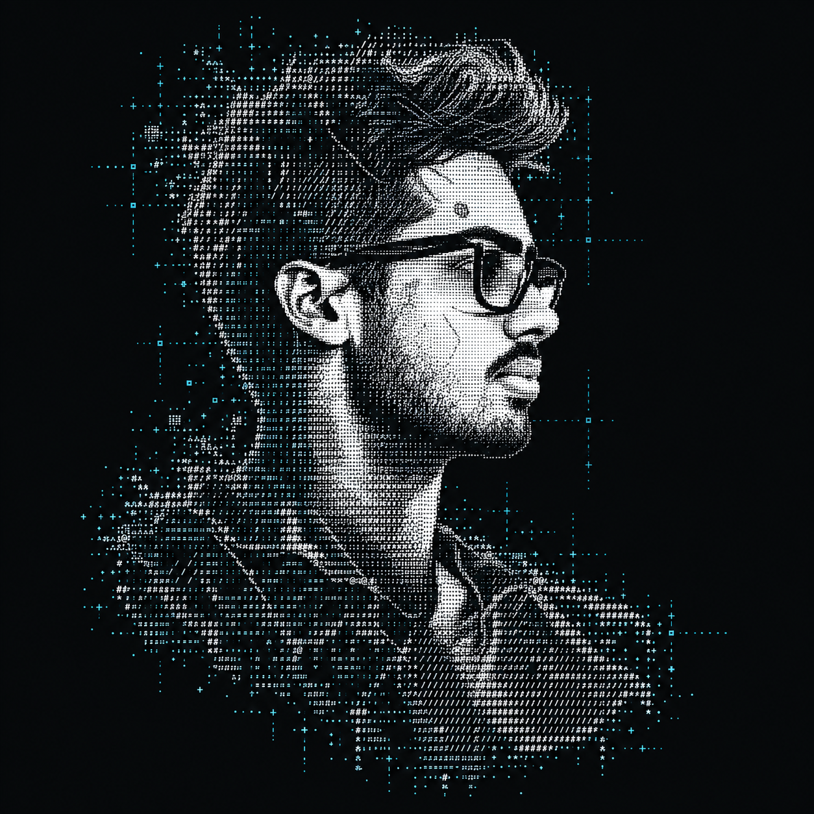

  

<pre>
┌─────────────────────────────────────────────────────────────┐
│  VAIBHAV SUMAN // AI ENGINEER                                │
│  Building applied AI systems and useful full-stack products. │
└─────────────────────────────────────────────────────────────┘
</pre>

<a href="https://vaibhavsuman.vercel.app/">Portfolio</a> · <a href="https://www.linkedin.com/in/vaibhav-suman/">LinkedIn</a> · <a href="https://twitter.com/VaibhavSuman00">X</a> · <a href="https://medium.com/@vaibhavsuman00">Medium</a>

## Now

- Designing AI-powered products, developer tools, and reliable backend systems.
- Exploring practical agentic workflows and the systems around them.
- Open to meaningful engineering collaborations.

## Selected work

## Contribution stream

<picture>
  <source media="(prefers-color-scheme: dark)" srcset="https://raw.githubusercontent.com/vsuman00/vsuman00/output/snake-dark.svg" />
  <source media="(prefers-color-scheme: light)" srcset="https://raw.githubusercontent.com/vsuman00/vsuman00/output/snake.svg" />
  
</picture>
