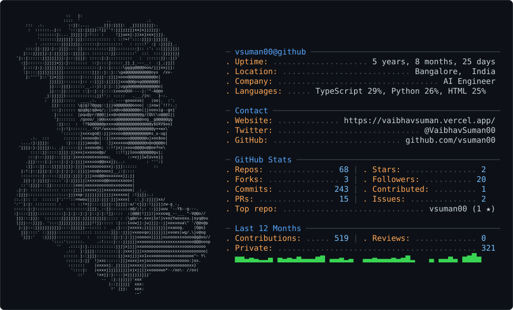

<picture>
  <source media="(prefers-color-scheme: dark)" srcset="./assets/profile-card-dark.svg" />
  <source media="(prefers-color-scheme: light)" srcset="./assets/profile-card-light.svg" />
  
</picture>

## Now

- Designing AI-powered products, developer tools, and reliable backend systems.
- Exploring practical agentic workflows and the systems around them.
- Open to meaningful engineering collaborations.

## Selected work

- [AI Resume Checker](https://github.com/vsuman00/ai_resume_checker)
- [SummarIQ](https://github.com/vsuman00/SummarIQ)
- [Retail Competitor Scout](https://github.com/vsuman00/Retail-Competitor-Scout)

## Contribution stream

<picture>
  <source media="(prefers-color-scheme: dark)" srcset="https://raw.githubusercontent.com/vsuman00/vsuman00/output/snake-dark.svg" />
  <source media="(prefers-color-scheme: light)" srcset="https://raw.githubusercontent.com/vsuman00/vsuman00/output/snake.svg" />
  
</picture>
